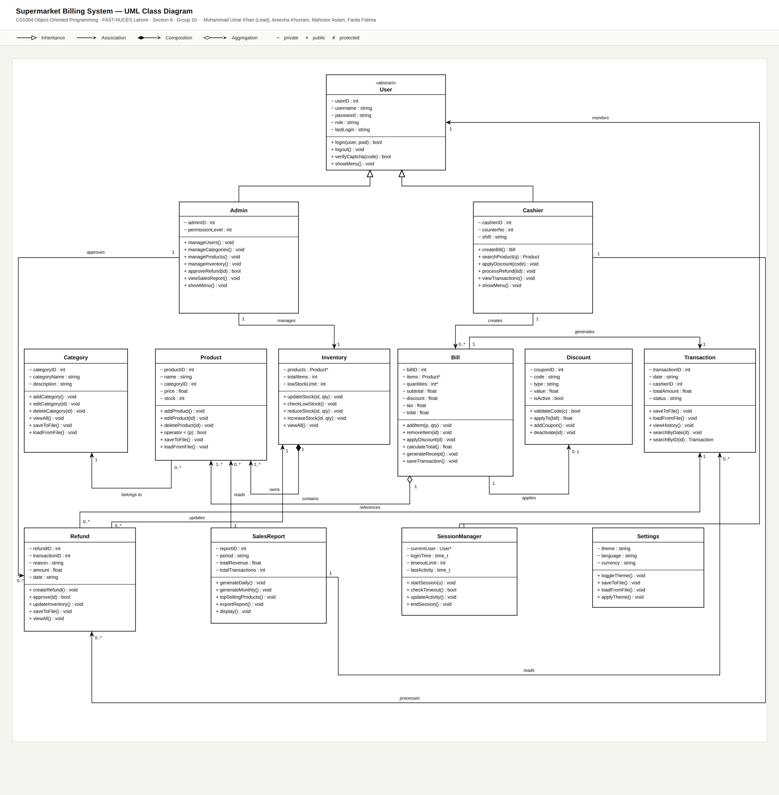

# 🛒 Supermarket Billing System

A C++ application for managing supermarket operations including billing, inventory, product management, and sales reporting. Built with OOP principles and a GUI interface, featuring role-based access for Admin and Cashier roles. Developed as a semester project at FAST-NUCES Lahore.

---

## 📋 Project Details

| Field | Details |
|---|---|
| Course | CS1004 — Object Oriented Programming |
| Institution | FAST-NUCES, Lahore |
| Semester | 2nd Semester |
| Section | A |
| Team | Group 10 |
| Instructor | Ms. Hina Iqbal |
| TA | Syed Saad Ali |

---

## 👥 Team Members

| Name | Roll No. | Role | Responsibilities |
|---|---|---|---|
| Muhammad Umar Khan | 25L-3089 | Team Lead | Category Management, Discount & Coupon System, Return & Refund Management, Session Timeout |
| Areesha Khurram | 25L-3007 | Member | User Management, Billing & Receipt Generation, Search & Filter Products, CAPTCHA, Password Strength |
| Mahnoor Aslam | 25L-3008 | Member | Sales Report Generation, Full GUI + all UI/UX visual implementation |
| Farda Fatima | 25L-3009 | Member | Product Management, Inventory & Stock Management, Transaction History, Dark/Light Mode |

---

## 🚀 Features

### 🔐 Admin Interface
1. **User Management** — Create, manage, and delete user accounts
2. **Category Management** — Organize products into categories
3. **Product Management** — Add, edit, and remove products
4. **Inventory & Stock Management** — Track stock levels and receive low stock alerts
5. **Return & Refund Management** — Process product returns and issue refunds
6. **Sales Report Generation** — View revenue summaries and top-selling products

### 🧾 Cashier Interface
7. **Billing & Receipt Generation** — Process customer purchases and generate receipts
8. **Discount & Coupon System** — Apply discount codes and offers at checkout
9. **Transaction History** — View records of past transactions
10. **Search & Filter Products** — Find products by name, category, or price

### 🎨 UI/UX & Security Features

1. **CAPTCHA Verification** — Randomly generated verification code at login to prevent unauthorized access
2. **Password Strength Indicator** — Live visual indicator during account creation to encourage secure passwords
3. **Dark / Light Mode** — Toggle between dark and light interface themes for visual comfort
4. **Session Timeout** — Automatically logs out inactive users to prevent unauthorized access

---

## 🧩 System Architecture

The system is designed around **12 classes** following OOP principles, with `User` as the abstract base class inherited by `Admin` and `Cashier`.



For the interactive version (zoomable in browser), see [docs/ClassDiagram_Group10.html](docs/ClassDiagram_Group10.html).

---

## 🛠️ Technologies Used

| Field | Details |
|---|---|
| Language | C++ |
| IDE | Visual Studio |
| GUI Framework | WinForms (CLR) |
| Data Storage | File Handling (CSV format) |
| Version Control | Git & GitHub |

---

## 💡 OOP Concepts Implemented

- Classes & Objects
- Constructors (Default, Parameterized, Copy)
- Function Overloading
- Operator Overloading
- Pointers & Dynamic Memory Allocation
- Inheritance
- Polymorphism
- Encapsulation & Abstraction
- Exception Handling
- Friend Functions
- Static Members
- Templates

---

## 📁 Project Structure

```
Supermarket-Billing-System/
│
├── Admin/
│   ├── Admin.{h,cpp}                   ✅ Muhammad Umar Khan
│   ├── Category.{h,cpp}                ✅ Muhammad Umar Khan
│   ├── CategoryManagement.{h,cpp}      ✅ Muhammad Umar Khan
│   ├── Product.{h,cpp}                 ✅ Farda Fatima
│   ├── ProductManagement.{h,cpp}       ✅ Farda Fatima
│   ├── Inventory.{h,cpp}               ✅ Farda Fatima
│   ├── InventoryManagement.{h,cpp}     ✅ Farda Fatima
│   ├── SalesReport.{h,cpp}             🔄 Mahnoor Aslam
│   └── UserManagement.{h,cpp}          🔄 Areesha Khurram
│   ├── Product.{h,cpp}                 ✅ Farda Fatima
│   ├── ProductManagement.{h,cpp}       ✅ Farda Fatima
│   ├── Inventory.{h,cpp}               ✅ Farda Fatima
│   ├── InventoryManagement.{h,cpp}     ✅ Farda Fatima
│   ├── SalesReport.{h,cpp}             ✅ Mahnoor Aslam
│   └── UserManagement.{h,cpp}          ✅ Areesha Khurram
│
├── Cashier/
│   ├── Billing.{h,cpp}                 🔄 Areesha Khurram
│   ├── Cashier.{h,cpp}                 ✅ Muhammad Umar Khan
│   ├── Billing.{h,cpp}                 ✅ Areesha Khurram
│   ├── Cashier.{h,cpp}                 ✅ Muhammad Umar Khan
│   ├── Discount.{h,cpp}                ✅ Muhammad Umar Khan
│   ├── DiscountManagement.{h,cpp}      ✅ Muhammad Umar Khan
│   ├── Refund.{h,cpp}                  ✅ Muhammad Umar Khan
│   ├── RefundManagement.{h,cpp}        ✅ Muhammad Umar Khan
│   ├── SearchFilter.{h,cpp}            🔄 Areesha Khurram
│   ├── Transaction.{h,cpp}             ✅ Farda Fatima
│   └── TransactionManagement.{h,cpp}   ✅ Farda Fatima
│   ├── SearchFilter.{h,cpp}            ✅ Areesha Khurram
│   ├── Transaction.{h,cpp}             ✅ Farda Fatima
│   └── TransactionManagement.{h,cpp}   ✅ Farda Fatima
│
├── Common/
│   ├── SessionManager.{h,cpp}          ✅ Muhammad Umar Khan
│   ├── Settings.{h,cpp}                ✅ Farda Fatima
│   └── User.{h,cpp}                    ✅ Muhammad Umar Khan
│
├── Data/
│   ├── categories.txt
│   ├── coupons.txt
│   ├── products.txt
│   ├── refunds.txt
│   ├── settings.txt
│   ├── transactions.txt
│   └── users.txt
│
├── GUI/                                🔄 Mahnoor Aslam (WinForms files)
│
├── docs/
│   ├── ClassDiagram_Group10.png
│   ├── ClassDiagram_Group10.html
│
├── main.cpp
└── README.md
```

**Legend:** ✅ Done  •  🔄 In Progress  •  ⏳ Pending

---

## 📊 Progress Tracker

| # | Feature | Owner | Status |
|---|---|---|---|
| 1 | User Management | Areesha | 🔄 In Progress |
| 2 | Category Management | Umar |  ✅ Done |
| 3 | Product Management | Farda |  ✅ Done |
| 4 | Inventory & Stock Management | Farda | ✅ Done |
| 5 | Return & Refund Management | Umar |  ✅ Done |
| 6 | Sales Report Generation | Mahnoor | 🔄 In Progress |
| 7 | Billing & Receipt Generation | Areesha |  🔄 In Progress |
| 6 | Sales Report Generation | Mahnoor | ✅ Done |
| 7 | Billing & Receipt Generation | Areesha |  ✅ Done |
| 8 | Discount & Coupon System | Umar |  ✅ Done |
| 9 | Transaction History | Farda |  ✅ Done |
| 10 | Search & Filter Products | Areesha |  🔄 In Progress |
| — | GUI (WinForms) | Mahnoor | 🔄 In Progress |
| 9 | Transaction History | Farda |  ✅ Done |
| 10 | Search & Filter Products | Areesha |  ✅ Done |
| — | GUI (WinForms) | Mahnoor | 🔄 In Progress |
| — | CAPTCHA Verification | Areesha | ✅ Done |
| — | Password Strength Indicator | Areesha | ✅ Done |
| — | Dark / Light Mode | Farda | ✅ Done |
| — | Session Timeout | Umar | ✅ Done |

---

## 📂 Data File Formats

All data files use comma-separated (CSV) format:

| File | Format |
|---|---|
| users.txt | UserID, Username, Password, Role |
| categories.txt | CategoryID, CategoryName |
| products.txt | ProductID, Name, CategoryID, Price, Stock |
| transactions.txt | TransactionID, Date, CashierID, TotalAmount, Status |
| coupons.txt | CouponID, Code, DiscountType, DiscountValue, IsActive |
| refunds.txt | RefundID, TransactionID, Reason, Amount, Date |
| settings.txt | theme=dark \| theme=light |

---

## 🖥️ Dual-Perspective Architecture

The system follows a dual-perspective architecture:

- **Admin Login** → Full access to manage products, categories, inventory, users, refunds and reports
- **Cashier Login** → Access to billing, search, discounts and transaction history

---

## ⚙️ How to Run

1. Clone the repository:
```
git clone https://github.com/umarkhan17006-cpu/Supermarket-Billing-System.git
```
2. Open the project in **Visual Studio**
3. Build and run the solution
4. Login as **Admin** or **Cashier** from the main menu

---

## 🌿 Branching & Contribution Workflow

The repository uses a **feature-branch workflow**:

| Branch | Purpose |
|---|---|
| `main` | Stable, working code only (protected) |
| `feature/Umar` | Umar's assigned features |
| `feature/Areesha` | Areesha's assigned features |
| `feature/Farda` | Farda's assigned features |
| `feature/Mahnoor` | Mahnoor's assigned features |

**Rules:**
- All development happens on individual `feature/<name>` branches
- Direct commits to `main` are restricted to documentation and project configuration
- Completed features are merged into `main` via Pull Requests reviewed by the Team Lead

---

## 📌 Development Approach

The project follows a **console-first** approach, with GUI integration planned after core logic is complete.

| Phase | Description | Status |
|---|---|---|
| Phase 1 | Foundation — file formats, base classes, main menu | ✅ Done |
| Phase 2 | Test all 10 features working | 🔄 In Progress |
| Phase 3 | GUI integration | ⏳ Pending |
| Phase 4 | Final testing, GitHub cleanup, LinkedIn posts | ⏳ Pending |

---

## 📄 License

This project is developed for academic purposes at FAST-NUCES Lahore under the MIT License.
